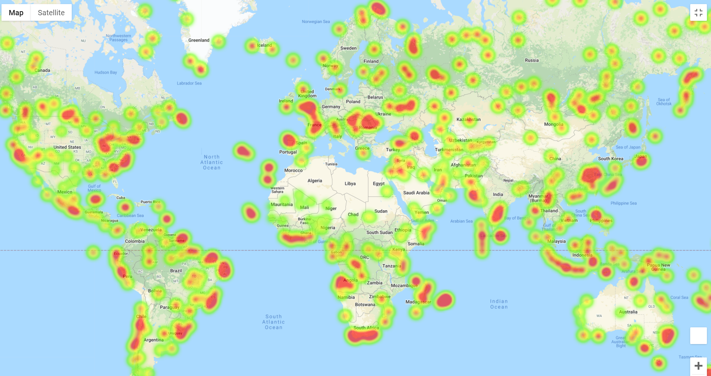
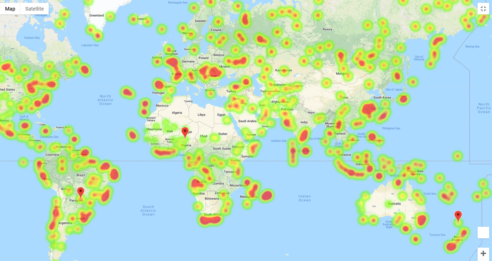

# Python API Homework - What's the Weather Like?

## Background

Whether financial, political, or social -- data's true power lies in its ability to answer questions definitively. So let's take what you've learned about Python requests, APIs, and JSON traversals to answer a fundamental question: "What's the weather like as we approach the equator?

In this assignment we will set out to prove the common belief that the weather gets warmer as we approach the equator.

## Part I - WeatherPy

In this section, I will create a Python script to visualize the weather of at least 500 cities across the world with different distances from the equator. To complete this task, I am utilizing a [simple Python library](https://pypi.python.org/pypi/citipy), and the [OpenWeatherMap API](https://openweathermap.org/api), to generate a representative weather sample for cities worldwide.

Our first requirement is to create a series of scatter plots to show the relationship between:

* Temperature (F) vs. Latitude
* Humidity (%) vs. Latitude
* Cloudiness (%) vs. Latitude
* Wind Speed (mph) vs. Latitude

Our second requirement is to run a linear regression for each relationship but now splitting our world at the equator to get the Northern Hemisphere (> or = 0 degrees latitude) and Southern Hemisphere (<0 degrees latitude):

* Northern Hemisphere: 
    * Temperature (F) vs. Latitude
    * Humidity (%) vs. Latitude
    * Cloudiness (%) vs. Latitude
    * Wind Speed (mph) vs. Latitude

* Southern Hemisphere: 
    * Temperature (F) vs. Latitude
    * Humidity (%) vs. Latitude
    * Cloudiness (%) vs. Latitude
    * Wind Speed (mph) vs. Latitude

### Part II - VacationPy

Now we will use our skills working with weather data to plan a future vacations. I will be using jupyter-gmaps and the Google Places API for this part of the assignment.

* First I will create a heat map that displays the humidity for every city from Part I.

  

* Second I will filter through my DataFrame dropping all rows that don't meet the all of the following weather conditions:

  * A max temperature lower than 80 degrees but higher than 70.

  * Wind speed less than 10 mph.

  * Zero cloudiness.

* Third I will use the Google Places API to find the first hotel for each city located within 5000 meters of your coordinates.

* Lastly I will plot the hotels on top of the humidity heatmap with each pin containing the **Hotel Name**, **City**, and **Country**.

  

### Final Considerations and Observations

* When generating a scatter plot with a linear regression to showcase the relationship between max temperature and latitude in the northern hemisphere we can see there is a strong negative correlation at -0.85. As cities in the northern hemisphere move further away from the equator, we can see max temperature gradually drop. 

* When generating a scatter plot with a linear regression to showcase the relationship between max temperature and latitude in the southern hemisphere we can see there is a positive correlation. As cities in the southern hemisphere move closer to the equator, we can see max temperature generally increase. The correlation of 0.55 in the southern hemisphere is not too significant but looking at the overall distribution of our scatter plot there seems to be some outliers skewing out data. 

* When generating a scatter plot to showcase the relationship between max temperature and city latitude we can see there is a curvilinear relationship meaning that as latitude increases so will max temperature but only up to a certain point at which it will start to decrease. Our point in this scatter plot happens to be the equator at latitude 0 therefore we could assume there is some truth to temperature rising as we get closer to the equator.  

* When generating a scatter plot to showcase the relationship of humidity, cloudiness, and wind speed against city latitude we can see there is no clear linear relationship. Our data points for these plots are all over the place. 

